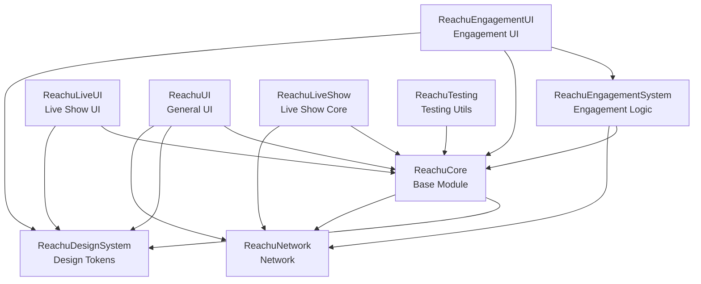

# SDK Structure Map - Mapa Completo de Estructura

**Última actualización**: Enero 23, 2026  
**SDK Version**: 2.1.0

---

## 📋 Tabla de Contenidos

1. [Árbol de Directorios Completo](#árbol-de-directorios-completo)
2. [Descripción de Módulos](#descripción-de-módulos)
3. [Responsabilidades de Managers](#responsabilidades-de-managers)
4. [Flujo de Datos](#flujo-de-datos)
5. [Dependencias entre Módulos](#dependencias-entre-módulos)
6. [Puntos de Entrada Principales](#puntos-de-entrada-principales)

---

## 1. Árbol de Directorios Completo

```
ReachuSwiftSDK/
├── Sources/
│   ├── ReachuCore/                          # Core SDK - Configuración y Managers
│   │   ├── Configuration/
│   │   │   ├── ReachuConfiguration.swift    # Singleton de configuración global
│   │   │   ├── ConfigurationLoader.swift    # Carga de configuraciones desde JSON
│   │   │   ├── ModuleConfigurations.swift   # Estructuras de configuración
│   │   │   ├── ReachuTheme.swift            # Sistema de temas
│   │   │   ├── ReachuLocalization.swift     # Sistema de localización
│   │   │   └── ReachuTranslationKey.swift  # Claves de traducción
│   │   ├── Managers/
│   │   │   ├── CampaignManager.swift       # Gestión de campañas y WebSocket
│   │   │   ├── DemoDataManager.swift       # Acceso a datos estáticos del demo
│   │   │   ├── CacheManager.swift          # Gestión de caché
│   │   │   └── DynamicConfigurationManager.swift # Configuración dinámica
│   │   ├── Models/
│   │   │   ├── CampaignModels.swift        # Modelos de campaña
│   │   │   ├── Product.swift               # Modelo de producto
│   │   │   ├── DynamicConfigModels.swift   # Modelos de configuración dinámica
│   │   │   ├── OfferBannerModels.swift     # Modelos de banner de ofertas
│   │   │   └── PlaceholderModels.swift    # Modelos de placeholders
│   │   ├── Network/
│   │   │   └── ConfigAPIClient.swift      # Cliente API para configuración
│   │   ├── Analytics/
│   │   │   └── AnalyticsManager.swift     # Manager de analytics
│   │   ├── Utils/
│   │   │   └── ReachuLogger.swift         # Sistema de logging
│   │   ├── Sdk/                            # GraphQL SDK
│   │   │   ├── Core/
│   │   │   │   ├── Errors/
│   │   │   │   │   └── SdkError.swift
│   │   │   │   ├── GraphQL/
│   │   │   │   │   ├── GraphQLHTTPClient.swift
│   │   │   │   │   ├── GraphQLErrorMapper.swift
│   │   │   │   │   └── GraphQLOpsSingleFile.swift
│   │   │   │   ├── Helpers/
│   │   │   │   │   └── GraphQLPick.swift
│   │   │   │   ├── Operations/
│   │   │   │   │   ├── CartGraphQL.swift
│   │   │   │   │   ├── ChannelGraphQL.swift
│   │   │   │   │   ├── CheckoutGraphQL.swift
│   │   │   │   │   ├── DiscountGraphQL.swift
│   │   │   │   │   ├── MarketGraphQL.swift
│   │   │   │   │   └── PaymentGraphQL.swift
│   │   │   │   └── Validation/
│   │   │   │       └── Validation.swift
│   │   │   ├── Domain/
│   │   │   │   ├── Models/
│   │   │   │   │   ├── CartModels.swift
│   │   │   │   │   ├── ChannelModels.swift
│   │   │   │   │   ├── CheckoutModels.swift
│   │   │   │   │   ├── DiscountModels.swift
│   │   │   │   │   ├── MarketModels.swift
│   │   │   │   │   ├── PaymentModels.swift
│   │   │   │   │   └── ProductModels.swift
│   │   │   │   └── Repositories/
│   │   │   │       ├── CartRepository.swift
│   │   │   │       ├── ChannelCategoryRepository.swift
│   │   │   │       ├── ChannelInfoRepository.swift
│   │   │   │       ├── ChannelMarketRepository.swift
│   │   │   │       ├── CheckoutRepository.swift
│   │   │   │       ├── DiscountRepository.swift
│   │   │   │       ├── MarketRepository.swift
│   │   │   │       ├── PaymentRepository.swift
│   │   │   │       └── ProductRepository.swift
│   │   │   └── Modules/
│   │   │       ├── CartModule.swift
│   │   │       ├── Channel/
│   │   │       │   ├── CategoryModule.swift
│   │   │       │   ├── Channel.swift
│   │   │       │   ├── ChannelMarketModule.swift
│   │   │       │   ├── InfoModule.swift
│   │   │       │   └── ProductModule.swift
│   │   │       ├── CheckoutModule.swift
│   │   │       ├── DiscountModule.swift
│   │   │       ├── MarketModule.swift
│   │   │       └── PaymentModule.swift
│   │   └── ReachuCore.swift                 # Exports principales
│   │
│   ├── ReachuEngagementSystem/              # Sistema de Engagement (Polls, Contests)
│   │   ├── Managers/
│   │   │   ├── EngagementManager.swift     # Manager principal (singleton)
│   │   │   └── VideoSyncManager.swift      # Sincronización con video
│   │   ├── Data/
│   │   │   ├── BackendEngagementRepository.swift    # Repositorio backend
│   │   │   ├── DemoEngagementRepository.swift      # Repositorio demo
│   │   │   ├── EngagementRepositoryProtocol.swift  # Protocolo
│   │   │   ├── EngagementCache.swift                # Caché de engagement
│   │   │   ├── NetworkClient.swift                  # Cliente de red
│   │   │   ├── RequestRetryHandler.swift            # Handler de reintentos
│   │   │   ├── EngagementDataValidator.swift        # Validador de datos
│   │   │   ├── EngagementMetrics.swift             # Métricas
│   │   │   ├── EngagementResponseModels.swift       # Modelos de respuesta
│   │   │   └── DemoDataConverter.swift             # Conversor de datos demo
│   │   ├── Models/
│   │   │   └── EngagementModels.swift     # Modelos (Poll, Contest, etc.)
│   │   └── ReachuEngagementSystem.swift   # Exports principales
│   │
│   ├── ReachuEngagementUI/                  # UI de Engagement
│   │   ├── Components/
│   │   │   ├── REngagementPollCard.swift   # Tarjeta de poll
│   │   │   ├── REngagementContestCard.swift # Tarjeta de contest
│   │   │   ├── REngagementProductCard.swift # Tarjeta de producto
│   │   │   ├── REngagementProductGridCard.swift # Grid de productos
│   │   │   ├── REngagementCardBase.swift   # Base común
│   │   │   ├── REngagementPollOverlay.swift # Overlay de poll
│   │   │   ├── REngagementContestOverlay.swift # Overlay de contest
│   │   │   └── REngagementProductOverlay.swift # Overlay de producto
│   │   └── ReachuEngagementUI.swift         # Exports principales
│   │
│   ├── ReachuLiveUI/                         # UI de Live Show
│   │   ├── Components/
│   │   │   ├── DynamicComponentManager.swift      # Manager de componentes dinámicos
│   │   │   ├── DynamicComponentRenderer.swift      # Renderizador de componentes
│   │   │   ├── DynamicComponents.swift            # Componentes dinámicos
│   │   │   ├── DynamicComponentsService.swift     # Servicio de componentes
│   │   │   ├── LiveStreamLayouts.swift            # Layouts de stream
│   │   │   ├── RLiveBottomTabs.swift               # Tabs inferiores
│   │   │   ├── RLiveChatComponent.swift           # Componente de chat
│   │   │   ├── RLiveLikesComponent.swift          # Componente de likes
│   │   │   ├── RLiveMiniPlayer.swift              # Mini player
│   │   │   ├── RLiveProductCard.swift             # Tarjeta de producto
│   │   │   ├── RLiveProductsComponent.swift       # Componente de productos
│   │   │   ├── RLiveProductsGridOverlay.swift     # Grid overlay de productos
│   │   │   ├── RLiveShowFullScreenOverlay.swift   # Overlay fullscreen
│   │   │   └── RLiveShowOverlay.swift             # Overlay principal
│   │   ├── Configuration/
│   │   │   └── RLiveShowConfiguration.swift       # Configuración de live show
│   │   └── ReachuLiveUI.swift               # Exports principales
│   │
│   ├── ReachuUI/                             # UI General
│   │   ├── Components/
│   │   │   ├── RProductCard.swift          # Tarjeta de producto
│   │   │   ├── RProductCarousel.swift      # Carrusel de productos
│   │   │   ├── RProductSlider.swift        # Slider de productos
│   │   │   ├── RProductSliderViewModel.swift # ViewModel del slider
│   │   │   ├── RProductBanner.swift       # Banner de producto
│   │   │   ├── RProductSpotlight.swift     # Spotlight de producto
│   │   │   ├── RProductStore.swift        # Store de productos
│   │   │   ├── RProductDetailOverlay.swift # Overlay de detalle
│   │   │   ├── RCheckoutOverlay.swift      # Overlay de checkout
│   │   │   ├── RFloatingCartIndicator.swift # Indicador de carrito flotante
│   │   │   ├── ROfferBanner.swift          # Banner de ofertas
│   │   │   ├── RMarketSelector.swift      # Selector de mercado
│   │   │   ├── RSponsorBadge.swift        # Badge de sponsor
│   │   │   └── CheckoutDraft.swift        # Borrador de checkout
│   │   ├── Managers/
│   │   │   ├── CartManager.swift           # Manager de carrito
│   │   │   ├── CartModels.swift            # Modelos de carrito
│   │   │   ├── CartMappings.swift         # Mapeos de carrito
│   │   │   ├── CartModule.swift            # Módulo de carrito
│   │   │   ├── CheckoutManager.swift       # Manager de checkout
│   │   │   ├── DiscountManager.swift       # Manager de descuentos
│   │   │   ├── MarketManager.swift         # Manager de mercado
│   │   │   ├── PaymentManager.swift        # Manager de pagos
│   │   │   └── VippsPaymentHandler.swift   # Handler de Vipps
│   │   ├── Helpers/
│   │   │   ├── ImageLoader.swift           # Cargador de imágenes
│   │   │   └── ReachuComponentWrapper.swift # Wrapper de componentes
│   │   ├── Services/
│   │   │   └── ProductService.swift       # Servicio de productos
│   │   ├── Resources/
│   │   │   └── PaymentIcons/              # Iconos de pago
│   │   └── ReachuUI.swift                 # Exports principales
│   │
│   ├── ReachuDesignSystem/                  # Sistema de Diseño
│   │   ├── Components/
│   │   │   ├── RButton.swift              # Botón base
│   │   │   ├── RToastNotification.swift   # Notificación toast
│   │   │   ├── RCustomLoader.swift        # Loader personalizado
│   │   │   ├── CachedAsyncImage.swift     # Imagen async con caché
│   │   │   └── CampaignSponsorBadge.swift # Badge de sponsor de campaña
│   │   ├── Tokens/
│   │   │   ├── ReachuColors.swift         # Colores
│   │   │   ├── AdaptiveColors.swift      # Colores adaptativos
│   │   │   ├── ReachuTypography.swift     # Tipografía
│   │   │   ├── ReachuSpacing.swift        # Espaciado
│   │   │   ├── ReachuBorderRadius.swift  # Radio de borde
│   │   │   └── ReachuShadow.swift        # Sombras
│   │   └── ReachuDesignSystem.swift       # Exports principales
│   │
│   ├── ReachuLiveShow/                      # Live Show Core
│   │   └── [Archivos del módulo Live Show]
│   │
│   ├── ReachuNetwork/                       # Network Core
│   │   └── [Archivos de red]
│   │
│   └── ReachuTesting/                      # Testing Utilities
│       ├── MockDataProvider.swift          # Proveedor de datos mock
│       └── ReachuTesting.swift             # Exports principales
│
└── Demo/
    └── Viaplay/                            # Demo de Viaplay
        └── Viaplay/
            ├── Configuration/
            │   ├── reachu-config.json      # Configuración principal
            │   ├── demo-static-data.json  # Data estática del demo
            │   ├── entertainment-config.json # Config de entretenimiento
            │   └── reachu-translations.json # Traducciones
            ├── Views/
            ├── Components/
            ├── Managers/
            └── Models/
```

---

## 2. Descripción de Módulos

### ReachuCore
**Propósito**: Core del SDK - Configuración, managers principales, y operaciones GraphQL.

**Responsabilidades**:
- Gestión de configuración global (`ReachuConfiguration`)
- Carga de configuraciones desde JSON (`ConfigurationLoader`)
- Gestión de campañas y WebSocket (`CampaignManager`)
- Acceso a datos estáticos del demo (`DemoDataManager`)
- Operaciones GraphQL para e-commerce
- Sistema de temas y localización
- Logging y analytics

**Dependencias**: Ninguna (módulo base)

### ReachuEngagementSystem
**Propósito**: Sistema de engagement - Polls, Contests, y participación de usuarios.

**Responsabilidades**:
- Gestión de polls y contests (`EngagementManager`)
- Sincronización con video (`VideoSyncManager`)
- Repositorios para backend y demo
- Caché y validación de datos
- Manejo de errores y reintentos

**Dependencias**: `ReachuCore`

### ReachuEngagementUI
**Propósito**: Componentes UI para engagement - Cards y overlays.

**Responsabilidades**:
- Tarjetas de polls y contests
- Overlays interactivos
- Componentes de productos relacionados

**Dependencias**: `ReachuEngagementSystem`, `ReachuCore`

### ReachuLiveUI
**Propósito**: UI para live shows - Componentes dinámicos y overlays.

**Responsabilidades**:
- Renderizado de componentes dinámicos (`DynamicComponentRenderer`)
- Gestión de componentes de campaña
- Layouts de live stream
- Componentes de chat y productos en vivo

**Dependencias**: `ReachuCore`

### ReachuUI
**Propósito**: UI general - Componentes de productos, carrito, checkout.

**Responsabilidades**:
- Componentes de productos (cards, carousels, sliders)
- Gestión de carrito (`CartManager`)
- Checkout y pagos (`CheckoutManager`, `PaymentManager`)
- Selector de mercado (`MarketManager`)
- Descuentos (`DiscountManager`)

**Dependencias**: `ReachuCore`

### ReachuDesignSystem
**Propósito**: Sistema de diseño - Tokens y componentes base.

**Responsabilidades**:
- Tokens de diseño (colores, tipografía, espaciado)
- Componentes base reutilizables
- Sistema de temas adaptativos

**Dependencias**: Ninguna (módulo base)

---

## 3. Responsabilidades de Managers

### CampaignManager
**Ubicación**: `ReachuCore/Managers/CampaignManager.swift`

**Responsabilidades**:
- Gestión del ciclo de vida de campañas
- Conexión WebSocket con Tipio
- Filtrado de componentes por `broadcastId`
- Auto-descubrimiento de campañas
- Estado de campaña activa/inactiva

**Public API**:
```swift
CampaignManager.shared
- currentCampaign: Campaign?
- currentBroadcastContext: BroadcastContext?
- isCampaignActive: Bool
- activeComponents: [Component]
- connect()
- disconnect()
- setBroadcastContext(_:)
```

### DemoDataManager
**Ubicación**: `ReachuCore/Managers/DemoDataManager.swift`

**Responsabilidades**:
- Acceso a datos estáticos del demo
- Fallback para valores hardcoded
- Mapeo de productos, assets, usuarios

**Public API**:
```swift
DemoDataManager.shared
- defaultLogo: String
- defaultAvatar: String
- productUrl(for: String) -> String?
- broadcastId(for: String) -> String?
- liveCards: [LiveCardItem]  // cada item incluye broadcastId para casting
- carouselCards: [CarouselCardItem]
- sportClips: [SportClipItem]
- randomChatUsername() -> String
- offerBannerCountdown: CountdownConfiguration

Nota: El modelo usa broadcast (liveCards con broadcastId), no matches
```

### EngagementManager
**Ubicación**: `ReachuEngagementSystem/Managers/EngagementManager.swift`

**Responsabilidades**:
- Gestión de polls y contests por `broadcastId`
- Carga paginada de engagement
- Votación y participación
- Sincronización con video

**Public API**:
```swift
EngagementManager.shared
- pollsByBroadcast: [String: [Poll]]
- contestsByBroadcast: [String: [Contest]]
- pollResults: [String: PollResults]
- loadEngagement(broadcastId:limit:offset:)
- voteInPoll(pollId:optionId:broadcastId:)
- participateInContest(contestId:broadcastId:answers:)
```

### CartManager
**Ubicación**: `ReachuUI/Managers/CartManager.swift`

**Responsabilidades**:
- Gestión del carrito de compras
- Agregar/remover productos
- Cálculo de totales
- Integración con checkout

**Public API**:
```swift
CartManager.shared
- items: [CartItem]
- total: Decimal
- addProduct(_:variant:quantity:)
- removeProduct(_:)
- clear()
```

### VideoSyncManager
**Ubicación**: `ReachuEngagementSystem/Managers/VideoSyncManager.swift`

**Responsabilidades**:
- Sincronización de polls/contests con tiempo de video
- Activación automática de componentes
- Gestión de timestamps

**Public API**:
```swift
VideoSyncManager.shared
- currentVideoTime: TimeInterval
- syncWithVideo(time:)
- registerComponent(_:atTime:)
```

---

## 4. Flujo de Datos

### Flujo de Configuración Inicial

```
App Launch
    ↓
ConfigurationLoader.loadConfiguration()
    ↓
ReachuConfiguration.configure(...)
    ↓
├── Load reachu-config.json
├── Load demo-static-data.json (si existe)
├── Initialize CampaignManager
├── Initialize DemoDataManager
└── Setup themes and localization
```

### Flujo de Demo Data

```
Componente SwiftUI necesita asset/URL
    ↓
DemoDataManager.shared.defaultLogo
    ↓
ReachuConfiguration.shared.demoDataConfiguration
    ↓
DemoDataConfiguration (desde JSON o defaults)
    ↓
Valor retornado al componente
```

### Flujo de Engagement

```
UI Component
    ↓
EngagementManager.shared.loadEngagement(broadcastId:)
    ↓
BackendEngagementRepository.loadPolls(...)
    ↓
├── Check EngagementCache
├── If miss: NetworkClient.fetch(...)
├── Validate data
└── Cache results
    ↓
EngagementManager updates @Published properties
    ↓
UI updates automatically
```

### Flujo de Campaña

```
App sets broadcast context
    ↓
CampaignManager.setBroadcastContext(_:)
    ↓
├── Auto-discover campaigns (if enabled)
├── Connect WebSocket
└── Filter components by broadcastId
    ↓
DynamicComponentRenderer shows components
    ↓
User interacts with component
    ↓
CampaignManager handles interaction
```

---

## 5. Dependencias entre Módulos



**Notas**:
- `ReachuCore` es el módulo base, sin dependencias externas
- `ReachuDesignSystem` es independiente (solo tokens)
- Todos los módulos UI dependen de `ReachuCore` y `ReachuDesignSystem`
- Los módulos de lógica dependen de `ReachuCore` y `ReachuNetwork`

---

## 6. Puntos de Entrada Principales

### 1. Configuración Inicial

**Archivo**: `ReachuCore/Configuration/ReachuConfiguration.swift`

```swift
// En App.swift o AppDelegate
ReachuConfiguration.configure(
    environment: .production,
    apiKey: "your-api-key",
    campaignConfig: CampaignConfiguration(...),
    demoDataConfig: DemoDataConfiguration(...), // Opcional
    engagementConfig: EngagementConfiguration(...)
)
```

### 2. Uso de CampaignManager

```swift
// Conectar a campaña
CampaignManager.shared.connect()

// Establecer contexto de broadcast
CampaignManager.shared.setBroadcastContext(
    BroadcastContext(broadcastId: "barcelona-psg-2025-01-23")
)

// Acceder a campaña actual
let campaign = CampaignManager.shared.currentCampaign
```

### 3. Uso de DemoDataManager

```swift
// Acceder a assets
let logo = DemoDataManager.shared.defaultLogo
let avatar = DemoDataManager.shared.defaultAvatar

// Obtener URLs de productos
if let url = DemoDataManager.shared.productUrl(for: "408895") {
    // Usar URL
}

// Obtener broadcastId
if let broadcastId = DemoDataManager.shared.broadcastId(for: "barcelona-psg") {
    // Usar broadcastId
}
```

### 4. Uso de EngagementManager

```swift
// Cargar engagement para un broadcast
Task {
    try await EngagementManager.shared.loadEngagement(
        broadcastId: "barcelona-psg-2025-01-23",
        limit: 10,
        offset: 0
    )
}

// Votar en poll
Task {
    try await EngagementManager.shared.voteInPoll(
        pollId: "poll-123",
        optionId: "option-1",
        broadcastId: "barcelona-psg-2025-01-23"
    )
}
```

### 5. Renderizado de Componentes Dinámicos

```swift
// En SwiftUI View
ZStack {
    VideoPlayer(...)
    
    DynamicComponentRenderer()
        .zIndex(10_000_000)
}
.onAppear {
    CampaignManager.shared.connect()
}
.onDisappear {
    CampaignManager.shared.disconnect()
}
```

---

## 📊 Resumen de Estructura

### Estadísticas
- **Módulos principales**: 9
- **Managers**: 8+
- **Componentes UI**: 50+
- **Modelos**: 30+
- **Repositorios**: 10+

### Principios de Diseño
1. **Separación de responsabilidades**: Cada módulo tiene un propósito claro
2. **Dependencias unidireccionales**: No hay dependencias circulares
3. **Singleton pattern**: Managers principales son singletons
4. **Protocol-oriented**: Uso extensivo de protocolos para testabilidad
5. **ObservableObject**: Managers usan `@Published` para reactividad

---

**Última actualización**: Enero 23, 2026  
**Versión**: 2.1.0
